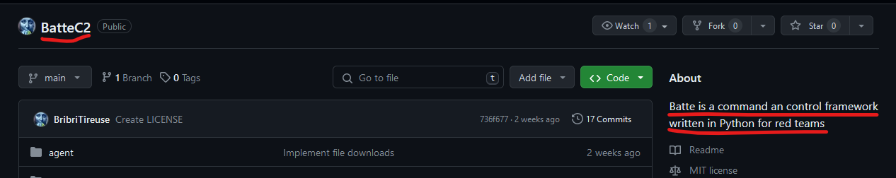
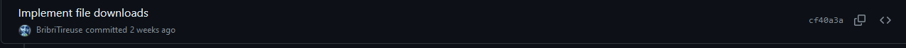
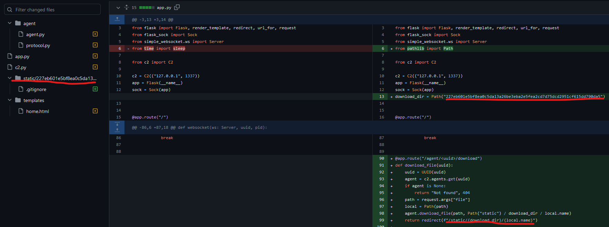

# Divers - Coup de Circuit 3 - Facile Variables

## Enonce 

Pour ce challenge, le service web à l'adresse suivante fait partie du périmètre : https://panel-5d4213f3bf078fb1656a3db8348282f482601690.takemeouttotheballgame.space. L'énumération automatique est toujours interdite. Ce challenge est un mix de plusieurs catégories.

Le fichier que l'on m'a volé se nomme *Secret-Mojo.pdf*. Vous pensez que l'on peut le retrouver à partir du panneau de contrôle ?

Mettez la main sur le fichier dérobé.

Auteur : Smyler

### Fichiers fournis :

Aucun

## Solution

Au début j'ai eu peur : je suis une bille dans tout ce qui touche aux injections SQL/NoSQL/etc... et j'ai pensé que pour passer le login il fallait utiliser ce genre de techniques, MAIS étant dans la catégorie **Divers** je me suis dit que la réponse était sûrement ailleurs.
La magie des connexions de neurones m'a fait me souvenir d'un challenge similaire du "**DGHack 2022**", dans lequel il fallait prendre le contrôle d'un C2. Le point d'entrée du challenge était de trouver le code source du panel du C2 sur "**github.com**" 

En allant chercher sur "**github.com**", on tombe sur le projet "**BatteC2**" qui correspond bien à un framework de C&C pour des red teamer 

> https://github.com/BribriTireuse/BatteC2

En regardant la liste des commits, un message de commit me semble plus intéressant que les autres "**Implements file downloads**". En effet si on cherche à récupérer un fichier sur le serveur, autant savoir comment s'est géré côté serveur.

On voit qu'un répertoire (**227eb601e5bf8ea0c5da13a26be3eba2e5fea2cd7d75dcd2951cf615dd790da5**) est créée dans le répertoire "**static**". Celui-ci semble être là pour recueillir les fichiers récupérés.

Sur le serveur de C&C on essaye d'accèder à ce répertoire, pour récupérer le fichier **Secret-Mojo.pdf**, et cela fonctionne. 

> https://panel-5d4213f3bf078fb1656a3db8348282f482601690.takemeouttotheballgame.space/static/227eb601e5bf8ea0c5da13a26be3eba2e5fea2cd7d75dcd2951cf615dd790da5/Secret-Mojo.pdf

Le PDF contient le flag de l'épreuve.

**Flag** : 404CTF{M4i5_p0urt@n7_mOn_s3rvEur_d3_C_&_c_3t4i7_s1_53cUrisE}
