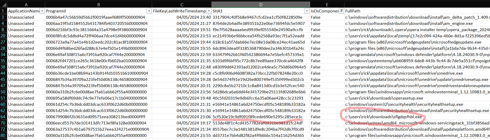

# Investigation Numérique - Coup de Circuit 1 - Facile Points variables

## Enonce 

Ce challenge est le premier d'une série de trois challenges faciles. Le challenge suivant sera disponible dans la catégorie Renseignement en sources ouvertes une fois que vous aurez validé celui-ci.

C'est la catastrophe ! Je me prépare pour mon prochain match de baseball, mais on m'a volé mon mojo ! Sans lui, je vais perdre, c'est certain... Je crois qu'on m'a eu en me faisant télécharger un virus ou je ne sais quoi, et le fichier a été supprimé de mon ordinateur. J'ai demandé de l'aide à un ami expert et il a extrait des choses du PC, mais il n'a pas le temps d'aller plus loin. Vous pourriez m'aider ?

Identifiez le malware et donnez son condensat sha1. Le flag est au format suivant : 404CTF{sha1}

Auteur : Smyler

### Fichiers fournis :

- Collection.zip : Un zip contenant plusieurs fichiers au format csv / hash MD5 : b018d1f191cb506275ea3ff6820a2065

## Solution

Une fois dezippé on se retrouve face à une collection de fichier csv. Je ne suis pas familier avec les noms des fichiers, mais je suis familier avec la manipulation de fichiers au format csv (merci les tableurs).

En regardant les headers des fichiers csv (qui correspondent aux noms des "colones" des valeurs ) on repère dans le fichier *20240505010820_Amcache_UnassociatedFileEntries.csv* une colonne "**SHA-1**". Or on nous demande de trouver un SHA1 pour valider le challenge, et vérification faite, dans les autres fichiers csv il n'y a aucune autre colonne SHA1.

On a donc trouvé le fichier qui (très certainement) contient notre réponse. On ouvre le fichier dans excel, et intégrant les données comme un tableur on peux filtrer un peu plus simplement sur les catégories.

Une des colonnes attire l'attention "IsOsComponent", en effet l'énoncé nous indique qu'on a à faire à un téléchargement, or si on ne garde que les programmes qui ne sont pas des composants OS, on aura des programmes "autre". En filtrant sur cette colonne on passe de 83 lignes à 20 lignes, ce qui permet une analyse plus rapide.

Un nom de programme saute aux yeux, en essayant avec le hash SHA-1 associé on valide le challenge.

**Flag** : 404CTF{5cf530e19c9df091f89cede690e5295c285ece3c}