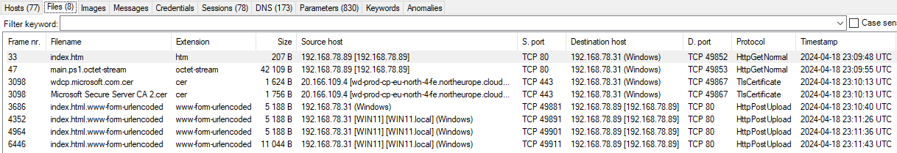
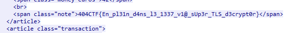

# Investigation Numérique - Darts Bank - Moyen Points variables

## Enonce 

*Attention : ce challenge contient du code à portée malveillante. Bien que l'auteur se soit efforcé de le rendre relativement inoffensif, il convient de prendre les mesures d'isolation adéquates s'il devait être exécuté. L'organisation décline toute responsabilité en cas de dommages à votre système.*

Je me dirigeais vers l'épreuve de lancer de fléchettes quand j'ai fait une découverte horrifiante : on m'a dérobé ma fléchette porte-bonheur ! Pourtant, cette dernière était bien sécurisée grâce à ma banque à fléchettes, DartsBank, et cette dernière a toutes les protections qui s'imposent... Même le petit cadenas vert ! Je crois avoir remarqué des choses étranges sur le réseau, vous pouvez y jeter un œil ?

Investiguez la capture réseau fournie et retrouvez le flag qui est au format habituel: 404CTF{...}.
 
MD5 dart.pcapng : a5d6bb16aaebbaae69de51ba653aa358

Auteur : Smyler

### Fichiers fournis :

- dart.pcapng : Une capture réseau

## Solution

On pourrait utiliser Wireshark, mais je préfère Network Miner pour l'extraction automatique de fichiers, d'ou la conversion de la capture en "pcap" (la version de démo de Network Miner n'acceptant pas les fichiers pcapng).\
On extrait de cette capture un ensemble de fichiers (répertoire "**AssembledFiles**", contient l'ensemble "brut" des fichiers), dont un fichier "**main.ps1**" qui est un script PowerShell obfusqué.

Cette capture met aussi en évidence deux adresses IP, ainsi que deux sessions différentes :

- @IP_A : 192.168.78.89 et @IP_B: 192.168.78.31 (à priori deux hosts Windows)
- Une première dans laquelle @IP_A se connecte à @IP_B :
    - pour consulter une page web (en erreur) (trame n°33)
    - pour récuperer le script powershell cité précédement (trame n°47) 
- Une deuxième session dans laquelle @IP_B se connecte à @IP_A pour envoyer quatres "form" (trames n°3686, 4352, 4964 et 6446)

Première supposition : Le script powershell a été téléchargé puis exécuté.
Deuxième supposition : C'est l'exécution du script powershell qui a déclenché l'envoi des quatres "form" (Exfiltration de documents chiffrés ?)

On va s'attaquer à la "dé-obfuscation" du script powershell.

### Analyse du script "main.ps1"

Ce script contient une séquence de plusieurs commandes powershell tout concaténées, une fois séparées on trouve six commandes :

1. Décode une chaîne base64 et l'exécute
2. Affecte une chaîne encodée en base64 dans une variable
3. Décode une chaîne base64 et l'exécute
4. Décode la variable créée en 2 puis recopie le résultat dans un fichier "**run.ps1**" situé dans le répertoire temporaire du système
5. Ajoute une clef au registre afin d'exécuter à chaque connection de l'utilisateur le script "**run.ps1**"
6. Exécute le script "**run.ps1**"

Hormis la première commande, toutes les autres sont "triviales" (la troisième étant un rickroll...). Le fichier généré "**run.ps1**" a été extrait dans son propre fichier.

#### Commande "1"

Le code contenu dans la commande 1 a été décodé et mis dans le script "**cmd1.ps1**" (code commenté et ré-écrit pour plus de compréhension).
Cette commande va parcourir tous les fichiers du répertoires des utilisateurs à la recherche d'un fichier appelé "chrome.exe".\
Si on trouve un fichier de la sorte on créée un raccourci en lui rajoutant le paramètre --ssl-key-log-file, ce qui va avoir pour effet de dumper les clefs ssl utilisée lors des communications. Le dump des clefs va s'effectuer dans le fichier "**defender-res.txt**" dans le répertoire temporaire de l'hôte.

#### Script run.ps1

Le fichier original "**run.ps1**" est conservé, une copie de travail "propre" est créée : "**run_cleaned.ps1**".
Une fois démarré, ce script scrute en permanence le fichier de log ouvert lors de la commande précédente.
Lorsqu'il détecte une modification du fichier de log : 
- il lit le nouveau contenu du fichier de log, 
- chiffre le contenu au moyen de la clef XOR du le script,
- encode en base64 le chiffré
- envoie au format POST le résultat de l'encodage vers l'adresse : http://192.168.78.89/index.html
- s'endort pendant 5sec avant de reprendre la surveillance du fichier

Parmi les fichiers extraits précédemment, on a quatre blob de data effectivement envoyé vers l'URL "**http://192.168.78.89/index.html**"
On va donc pouvoir procéder au déchiffrement, puis utiliser ces différents fichiers de log pour déchiffrer le traffic de la trame (et peut-être trouver le flag).

### Déchiffrement des blobs de data

On possède les différents de blobs de données extraits ainsi que la clef XOR utilisée pour le chiffrement. Le chiffrement par XOR étant réversible, on peux donc procéder au déchiffrement sans trop de soucis.\
Le script "**decrypt.py**" permet de déchiffrer les blobs de data et génére un fichier à importer dans Wireshark pour déchiffrer les échanges.

### Analyse des échanges

Une fois les logs ssl extraits on peux les appliquer dans Wireshark pour déchiffrer le traffic.
Mais un soucis apparait rapidement : il semblerait que Network Miner n'ait pas extrait tous les fichiers échangés. En repassant dans wireshark, effectivement il y'a 9 envois de fichiers de logs ssl. Une update est nécessaire pour avoir l'intégralité des fichiers utiles. (DONE)
En reprenant les différentes sessions ouvertes via l'outil Network Miner, une session vers le domaine "**dartsbank.challenges.404ctf.fr** apparait.\
On récupère donc l'IP et on filtre dessus dans Wireshark.
En regardant les différents échanges Web, on découvre le flag dans une page.

## Résumé

On a donc vu un challenge en plusieurs étapes :
- Acquisition d'un dropper d'un script malveillant
- Reverse du dit script
- Extraction de données permettant le déchiffrement des échanges SSL
- Déchiffrement d'achange (et recouvrement du flag)

**Flag** : 404CTF{En_pl31n_d4ns_l3_1337_v1@_sUp3r_TLS_d3crypt0r}