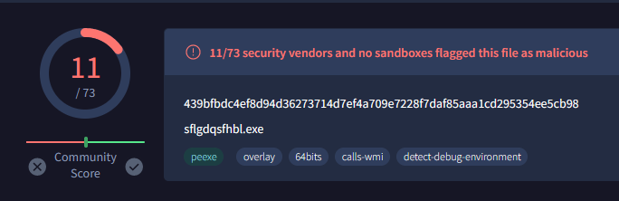
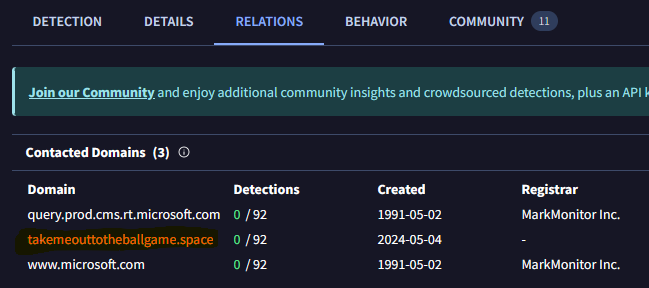
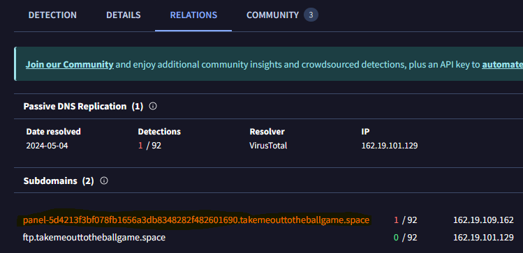
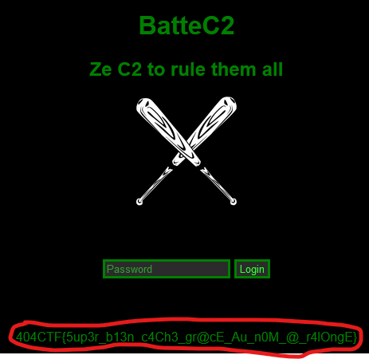

# Renseignement en sources ouvertes - Coup de Circuit 2 - Facile variable

## Enonce 

*Le challenge suivant sera disponible dans la catégorie Divers une fois que vous aurez validé celui-ci.*

Super ! Grace à vous j'ai pu retirer le fichier de mon PC, mais pensez-vous qu'il serait possible d'en savoir un peu plus sur ce malware ?
Retrouvez l'interface web du panneau de Command & Control du malware.

Le flag y sera reconnaissable.

Auteur : Smyler

### Fichiers fournis :

Aucun

## Solution

Dans le challenge précédent on a récupéré un hash d'un "**virus**" et nous sommes dans la catégories "**Renseignement en sources ouvertes**", un nom de site vient tout de suite en tête "**Virus Total**".

En allant sur le site et en faisant une recherche avec le hash trouvé lors de l'épreuve précédente, on trouve une réponse :

> https://www.virustotal.com/gui/file/439bfbdc4ef8d94d36273714d7ef4a709e7228f7daf85aaa1cd295354ee5cb98

En regardant dans l'onglet des relations on voit que plusieurs domaines sont contactés et un sort du lot :
- Il a un nom différent des deux autres
- Il a été déposé récemment

En cliquant dessus on peux aller voir les informations que *Virus Total* possède sur le domaine en question.
En utilisant la super technique du "clic partout fou", on atteri dans le champ "**relations**" qui pointe vers un domaine intéressant :

> https://panel-5d4213f3bf078fb1656a3db8348282f482601690.takemeouttotheballgame.space/login

J'ai laissé de côté le domaine "ftp" car il me semblait trop "normal". 

En accédant au domaine en question on arrive sur une page de login, le flag de l'épreuve est affiché en gros sur la page.

**Flag** : 404CTF{5up3r_b13n_c4Ch3_gr@cE_Au_n0M_@_r4lOngE}