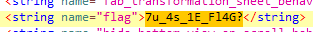
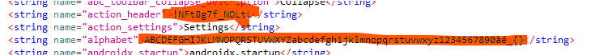
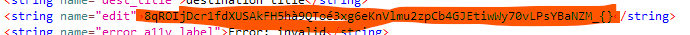

# Retro Ingénierie - Bugdroid Fight 2 /2 - Moyen points variables

## Enonce 

Vous venez de consulter le message du Bugdroid...

Dans son message, il explique que le combat ne peut être gagné à la seule force des poings... À moins que vous ne soyez aidé d'une force divine : une formule magique se cache ici, elle vous permettra de gagner le duel.

Format de flag : 404CTF{formule_magique}

Auteur : Whiplash

### Fichiers fournis :

- Bugdroid_Fight_-_Part_2.aab : Une application android

## Solution

Je ne suis pas familier avec le format aab, mais renseignement pris ça a l'air d'être le successeur du format "apk".
On peux donc ouvrir le fichier avec **jadx-gui**. Le code ne me parle pas beaucoup, mais avec l'expérience de la partie 1 de challenge, on va regarder du côté des chaînes de caractères dans le fichier *strings.xml*.

Une string saute aux yeux : 

Mais evidement ce n'est pas le flag.

Mais d'autres strings attirent l'oeil :

Au début je pensais que c'était une version modifié du base64, mais sans succès.
Les deux chaînes les plus longues étant de même longueur, j'ai ensuite supposé à un chiffre de substitution (la chaîne la plus courte étant possiblement le flag).

Après un court décodage, on trouve la chaîne : !0RvAd1K_0D4v4.
Lisant depuis trop longtemps du l33t5p34k et étant familier des écrits de la plus transphobe des écrivaines de romans pour enfants, je repère une chaine lisible à l'envers qui peux faire penser à quelque chose de sensé.

En inversant la chaîne et en mettant le bon format de flag, le challenge est validé.

**Flag** : 404CTF{4v4D0_K1dAvR0!}