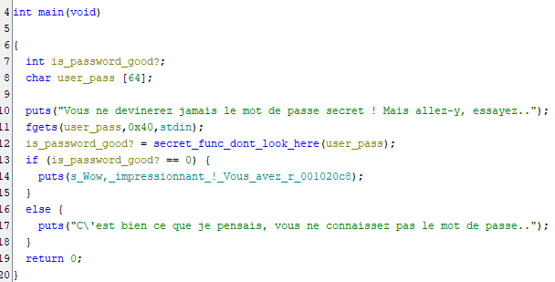
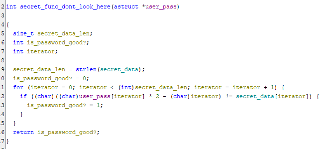

# Retro Ingenierie - Echauffement - Introduction 100pts

## Enonce 

Un bon échauffement permet non seulement d'éviter des blessures, mais aussi de conditionner son corps et son esprit au combat qui va suivre. Ce crackme devrait constituer un exercice adéquat.

Auteur : Izipak (_hdrien)

### Fichiers fournis :

- echauffement.bin : un binaire pour Linux x64, non strippé

## Solution

Le binaire n'est pas strippé et contient encore tous les noms de fonctions et de variable.

Le main est plutôt simple : 

- On récupère la saisie utilisateur. 
- On l'envoie dans une fonction (**secret_func_dont_look_here**)
- Si le retour de cette fonction est égale à 0 --> On a bon
- Sinon --> Pas de le bon mot de passe.

On va donc voir ce que fait la fonction **secret_func_dont_look_here** :

La fonction va donc chercher une variable "**secret_data**", récupère sa longueur et va itérer dessus caractère par caractère.
Lors de l'itération on compare le caractère courant saisi par l'utilisateur avec celui contenu à la même place dans "**secret_data**".

Tant que les caractères sont pareils, la variable de retour reste à 0, si les caractères sont différents on renvoie 1.

Pour chaque caractère de l'utilisateur on applique la fonction suivante avant la comparaison :

> (val_ascii_caractère * 2) - position_courante

C'est ce résultat qui est comparé. L'opération mathématique peut-être renversé sans soucis.

On extrait **secret_data** et on écrit le script "**solve.py**" qui nous donne la solution.

**Flag** : 404CTF{l_ech4uff3m3nt_3st_t3rm1ne}
