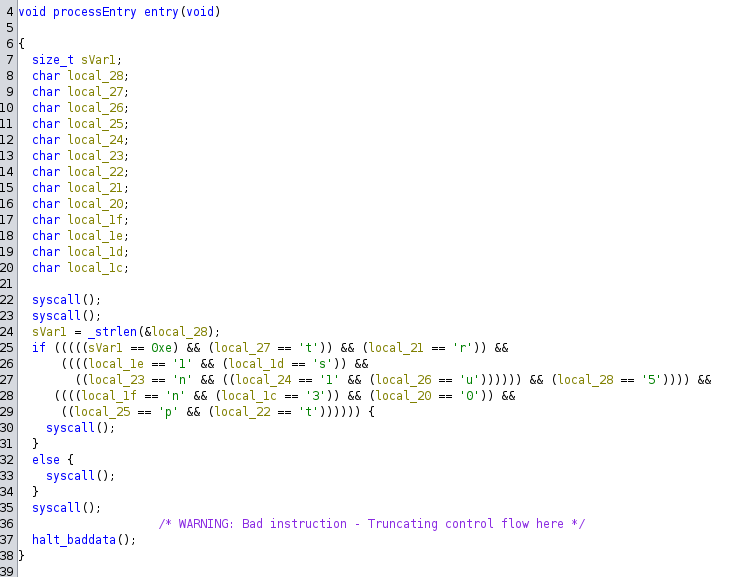

# Retro Ingenierie - Intronisation du CHAUSSURE - Facile 200pts

## Enonce 

Montrez votre valeur

Le CHAUSSURE, cette fameuse entité pionnière dans le domaine du sport de combat a ouvert un tournoi pour tous les chat-diateurs qui souhaiteraient se mesurer au reste du monde. Les présélections commencent et un premier défi a été publié par le CHAUSSURE. Ce dernier semble très cryptique, à vous d'en déceler les secrets!

Format de flag : 404CTF{mot-de-passe}
 
Auteur : Narcisse

### Fichiers fournis :

- intronisation : un binaire pour Linux x64, non strippé

## Solution

On ouvre le binaire avec Ghidra. Le code semble plutôt semble, bien qu'utilisant les syscalls pour masquer les appels à des fonctions "classiques" d'interactions avec l'utilisateur.

On récupère une taille de string (probablement une saisie utilisateur), puis on effectue diverses comparaisons.\
Si toutes les comparaisons sont OK on effectue un syscall vers une fonction d'affichage avec le message de victoire.\
Sinon on affiche le message de défaite.

On exécute le binaire en dynamique en plaçant un breakpoint juste après l'appel à **strlen()** (@0x401055), les comparaisons démarrant juste après.\

### Comparaisons

- 00401058 CMP  RAX,0xe --> Juste après strlen. La taille du password attendue est donc 0xe == 14 --> Password = 1234567890123 (ne pas oublier que le 0xa de fin compte !)
- 00401066 CMP  byte ptr [RDI]=>local_27,0x74 --> Deuxième caractère == 0x74  / "t" --> 1t34567890123
- 00401077 CMP  byte ptr [RDI]=>local_21,0x72 --> Huitième caractère == 0x72  / "r" --> 1t34567r90123
- 00401088 CMP  byte ptr [RDI]=>local_1e,0x31 --> Onzième caractère == 0x31   / "1" --> 1t34567r90123
- 00401099 CMP  byte ptr [RDI]=>local_1d,0x73 --> Douzième caractère == 0x73  / "s" --> 1t34567r901s3
- 004010a6 CMP  byte ptr [RDI]=>local_23,0x6e --> Sixième caractère == 0x6e   / "n" --> 1t345n7r901s3
- 004010b3 CMP  byte ptr [RDI]=>local_24,0x31 --> Cinquième caractère == 0x31 / "1" --> 1t341n7r901s3
- 004010c0 CMP  byte ptr [RDI]=>local_26,0x75 --> Troisième caractère == 0x75 / "u" --> 1tu41n7r901s3
- 004010cd CMP  byte ptr [RDI]=>local_28,0x35 --> Premier caractère == 0x35   / "5" --> 5tu41n7r901s3
- 004010da CMP  byte ptr [RDI]=>local_1f,0x6e --> Dixième caractère == 0x6e   / "n" --> 5tu41n7r9n1s3
- 004010e7 CMP  byte ptr [RDI]=>local_1c,0x33 --> Treizième caractère == 0x33 / "3" --> 5tu41n7r9n1s3
- 004010f4 CMP  byte ptr [RDI]=>local_20,0x30 --> Neuvième caractère == 0x30  / "0" --> 5tu41n7r0n1s3
- 00401101 CMP  byte ptr [RDI]=>local_25,0x70 --> Quatrième caractère == 0x70 / "p" --> 5tup1n7r0n1s3
- 0040110e CMP  byte ptr [RDI]=>local_22,0x74 --> Septième caractère == 0x74  / "t" --> 5tup1ntr0n1s3

Le password est donc : 5tup1ntr0n1s3

**Flag** : 404CTF{5tup1ntr0n1s3}