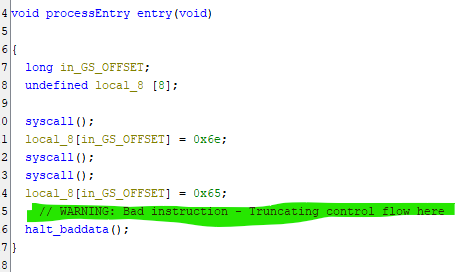
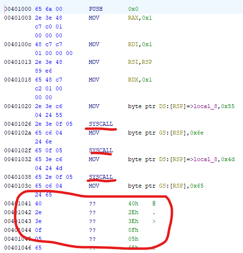

# Steganographie - La barre fixe - Facile variable

## Enonce 

C'est le grand moment, tous les yeux sont rivés sur vous. Vous vous apprêtez à commencer votre prestation sur l'épreuve de la barre fixe.
Mais quelques instants avant de vous élancer, vous remarquez un détail intriguant. Certaines choses sont là... alors qu'elles ne devraient pas l'être...
Un message peut être ?

Auteur : Redhpm

### Fichiers fournis :

- chall : un binaire

## Solution

Sans doute le challenge qui a fait ragé beaucoup de personnes, et qui était sans doute "mal" catégorisé (IMHO : c'était au moins une difficulté "moyenne").

### Le binaire sous Ghidra

On a un binaire, donc par réflexe on l'ouvre avec Ghidra. On voit plusieurs choses :

- Des noms de sections qui comportent des liens Youtube vers un rickroll
- Une longue chaîne "iii"
- Une fonction main avec des syscalls
- La décompilation se passe mal pour Ghidra

En exécutant le binaire, il affiche un message : "UnMessagePasDuToutSuspect"[^1]

L'inspection du binaire avec Ghidra est donc mitigé, mais on voit que ghidra a quelques soucis à la décompilation alors que le code semble simple.
Une autre chose me semble un peu bizarre : L'opcode de la première instruction (0x65 0x6a 0x00 // push 0x0) me semble bizarre. Avant ce challenge j'avais déjà passé (beaucoup) de temps dans du code assembleur, et quelque chose me dérange sans savoir quoi[^2].

### Le binaire sous objdump

Comme on dit (parfois) : "*L'outil ne fonctionne pas ? Change d'outil !*"
J'ai donc passé le binaire dans **objdump** afin d'avoir un deuxième avis :

> objdump -d chall > chall_dump_out

En lisant le résultat d'objdump, quelque chose m'a sauté aux yeux :

> **gs** push $0x0 \
> **cs** **ds** mov $0x1,%rax \
> mov    $0x1,%rdi \
> **cs** **ds** mov %rsp,%rsi \
> **gs** mov $0x1,%rdx \
> **cs** **ds** movb $0x55,(%rsp) \
> **cs** **ds** syscall \
> movb   $0x6e,%**gs**:(%rsp) \
> **gs** syscall \
> **gs** movb $0x4d,%**gs**:(%rsp) \
> **gs** **cs** syscall \
> movb   $0x65,%**gs**:(%rsp) \
> **rex** **cs** **ds** syscall \
> **gs** **cs** movb $0x73,%**gs**:(%rsp) \
> etc...

Des symboles en plus apparaissent. Quelques recherches plus tard j'apprends qu'on appelle ça des *segments de registres*. Et je fais le lien avec ce qui me dérangeais plus haut ([^2]), l'opcode du "push 0x0" aurait dû simplement être "**0x6a 0x00**".

### Le déchiffrement

Je pense qu'on a à faire une à une stega custom. Dans ces cas, pour m'aider à visualiser ce que je dois chercher j'écris la partie ASCII fixe du flag (quand il y'en a une) sous diverses formes : binaire, octal, hexa etc...

|Char | Code ASCII hexa | Code ASCII Binaire | Code ASCII decimal |
|:---:|:---------------:|:------------------:|:------------------:|
|4    | 0x34            | 0011.0100          | 52
|0    | 0x30            | 0011.0000          | 48
|4    | 0x34            | 0011.0100          | 52
|C    | 0x43            | 0100.0011          | 67
|T    | 0x54            | 0101.0100          | 84
|F    | 0x46            | 0100.0110          | 70 
|{    | 0x7B            | 0111.1011          | 123

En regardant les deux premières lignes de l'assembleur :

> **gs** push $0x0 \
> **cs** **ds** mov $0x1,%rax \

Je remarque qu'il y'a autant de "*segment de registre*" que de "1" dans la version binaire du "4". Je suppose donc trois choses :

- La présence d'un segment de registre représente un "1"
- L'absence d'un segment de registre représente un "0"
- Pour chaque octets camouflés dans le code, les bits de poids faibles sont indiqués en premier.

Néanmoins sur les premières lignes il n'y a que 3 segments qui apparaissent. Or pour pouvoir encoder 8 bits, un multiple de 2 est plus pratique...

En poussant mon analyse aux 14 premières lignes (7 caractères fixes, 2 caractères par ligne, donc 14 lignes à analyser), je remarque que les deux "dernières" font apparaitre le segment "rex", ce qui porte donc à 4 le nombre de segments.

Pour deviner l'ordre dans lequel les segments de registre doivent être placer, j'ai fait quelques essais, mais très vite j'ai trouvé : rex / gs / cs /ds

### Conclusion

Pour retrouver le flag :

- Pour chaque ligne d'assembleur on regarde les segments de registres.
- Si un segment présent on met à 1, sinon à 0
- Une ligne encode un nibble --> Deux lignes un octet
- Les bits de poids faibles sont en premier
- A certains moment j'ai eu des erreurs de décodage, objdump interpretant parfois mal le binaire, à ces moments-là je me suis rabattu sur le code hexa pour voir les segments de registres utilisés

rex | gs | cs | ds
:--:|:--:|:--:|:--:
0x40| 0x65| 0x2e| 0x3e

Après quelques minutes on récupère les valeurs ASCII en binaire du flag, un coup de CyberChef et hop, le flag !

**Flag** : 404CTF{x86_64-iGnor3s-5TuFF}

[^1] : Je cite ça de mémoire. Je rédige ce write-up sans pouvoir exécuter le binaire, et j'ai la maxi-flemme de lancer une VM pour faire ça...
