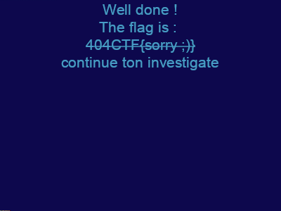

# Steganographie - Le grand écart - Moyen variable

## Enonce 

En sortant de votre cours de gymnastique, vous tombez sur un étrange bouquin dans les vestiaires... À vous d'en trouver tous les secrets.

Auteur : acmo0

### Fichiers fournis :

- challenge.txt : Un fichier texte

## Solution

Le fichier texte contient la nouvelle "Moby Dick". Une rapide recherche permet de trouver [un dépôt](https://gist.github.com/StevenClontz/4445774) qui contient un texte similaire.

Certains caractères du fichier du challenge ont l'air d'être différent. En analysant les différences entre les deux fichiers on se rend compte qu'à partir de la position 150, et tous les 30 caractères, les caractères sont différents.

Cela dit les caractères récupérés de cette manière n'ont pas de cohérence, mais en faisant un *XOR* entre le caractère "original" et celui du fichier du challenge, on commence à obtenir le début du header d'un fichier *PNG*.

Le script "**solve.py**" permet de générer l'image cachée dans le texte du challenge.

Visiblement le challenge n'est pas fini... Cela dit un groupe de pixel en bas à droite de l'image ressort.
Le groupe de pixel est un leurre... En convertissant les valeurs hexadecimale des couleurs en caractères ASCII on obtient un lien vers une vidéo Youtube qui est un rickroll.

En analysant le fichier avec zSteg on obtient le flag dans le canal suivant :

> b1,rgba,lsb,xy .. text: "404CTF{you_spot_w3ll_the_differences}\n"

**Flag** : 404CTF{you_spot_w3ll_the_differences}