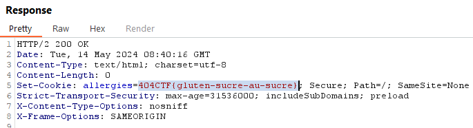

# Web - Vous êtes en retard - Introduction 100pts

## Enonce 

Vous voilà devant le stade pour voir le dernier match de votre équipe préférée, le Gorfou FC !
Malheureusement, vous êtes arrivé.e en retard et l'entrée est fermée... Mais pas de panique, il vous suffit de trouver un moyen pour quand même rentrer !

Auteur : Asumamusa

### Fichiers fournis :

- https://en-retard.challenges.404ctf.fr/ : Le site web a exploité

## Solution

#### Step 1 :
> https://en-retard.challenges.404ctf.fr/ 

On arrive sur une page avec un panneau "interdit". Une énumération rapide à la main ne donne rien (robots.txt, /admin, /login, etc...).
En regardant le code source, on voit qu'on a une route vers "/donnez-moi-mon-ticket-pitie"

#### Step2 :
> https://en-retard.challenges.404ctf.fr/donnez-moi-mon-ticket-pitie

Le texte présent sur la page nous oriente vers le javascript :

```
Oh non ! Comme vous êtes arrivé en retard, votre ticket ne fonctionne plus ! C'était pourtant indiqué dessus d'arriver à l'heure...
Néanmoins, vous avez toujours accès au code de la borne de validation, fait en Javascript ! A vous de jouer pour valider votre ticket !
```

En regardant dans la source de la page on voit effectivement un bout de javascript :

```js
    var bouton = document.querySelector('.valider-billet');
    var billet = document.querySelector('.billet');
    window.validable = [];
    bouton.addEventListener('click', function() {
        if (window.validable.includes(billet.id)) {
            fetch('/set_cookie', {method: 'POST'}).then(function() {
                window.location.href = "/devant-le-match";
            });
        } else {
            alert('Billet non validé');
        }
    });
```

Je ne suis pas expert en JS, mais je copmprends que si il y'a quelque chose dans "validable", on passe par la route /set_cookie en POST, puis on a une redirection vers la route /devant-le-match.

On essaye donc d'appeler la route /set-cookie en POST avec un outil comme burp ou les outils développeurs de firefox.

En réponse, on voit qu'un cookie est mis dans la réponse. On essaye ce cookie sur le site et c'est bien le flag.



**Flag** : 404CTF{gluten-sucre-au-sucre}
